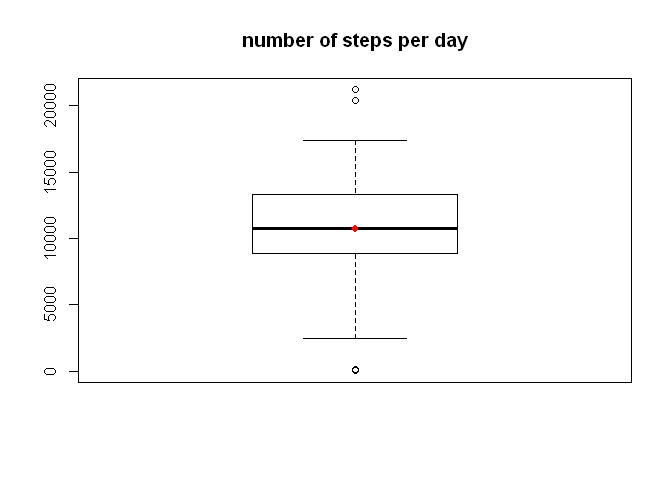
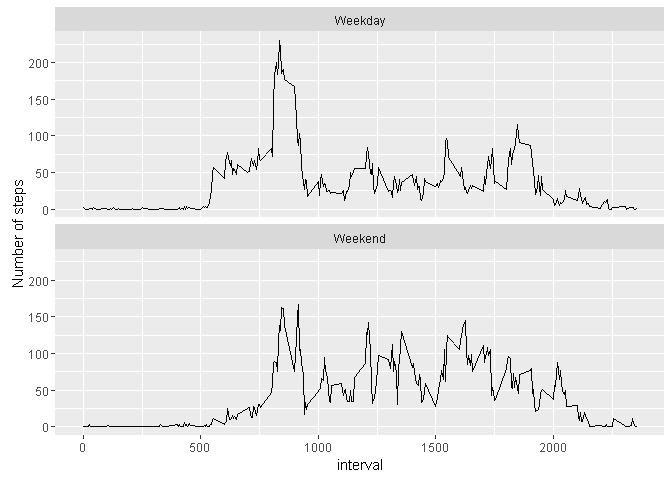

# Assignment: personal activity monitoring
Jeroen van der A  
May 14, 2016  

## calling necessary libraries

```r
library(plyr)
```

```
## Warning: package 'plyr' was built under R version 3.2.4
```

```r
library(ggplot2)
```

```
## Warning: package 'ggplot2' was built under R version 3.2.4
```

```r
library(lubridate)
```

```
## Warning: package 'lubridate' was built under R version 3.2.4
```

```
## 
## Attaching package: 'lubridate'
```

```
## The following object is masked from 'package:plyr':
## 
##     here
```

## loading and cleaning data

```r
stepdata = read.csv('activity.csv', na.strings=c("NA"))
```

## What is mean total number of steps taken per day?


```r
aggrsteps <- aggregate(steps ~ date, data=stepdata, sum)
hist(aggrsteps$steps, 
     xlab='steps', 
     main='Frequency of days where a number of steps have been made',
     breaks=8,
     col="lightgray"
     )
```

<!-- -->

## Calculate and report the mean and median total number of steps taken per day


```r
mean(aggrsteps$steps)
```

```
## [1] 10766.19
```

```r
median(aggrsteps$steps)
```

```
## [1] 10765
```
#### Extra step to visualize the last question and see how the data is spread.

```r
boxplot(aggrsteps$steps,data=aggrsteps, 
        main="number of steps per day")
points(mean(aggrsteps$steps),
       col="red",
       pch=18)
```

<!-- -->

## What is the average daily activity pattern?


```r
intervalmean = aggregate(steps ~ interval, data=stepdata, mean)
plot(intervalmean$interval, intervalmean$steps, type='l',
	 xlab='5 minute interval', ylab='average number of steps')
```

<!-- -->

## Imputing missing values


```r
sum(is.na(stepdata))
```

```
## [1] 2304
```

```r
cleanstepdata <- stepdata[complete.cases(stepdata),]
dirtystepdata <- stepdata[!complete.cases(stepdata),]
cleanedstepdata <- merge(dirtystepdata[, -1], intervalmean, all.x=T)

allcleandata <- rbind(cleanstepdata,cleanedstepdata)
```

## Are there differences in activity patterns between weekdays and weekends?


```r
allcleandata <- mutate(allcleandata, date = ymd(date), 
                       weekday = weekdays(ymd(date)),
                       day_type = ifelse(weekday == "Saturday" | weekday == "Sunday", "Weekend", "Weekday")
                       )
cleandata_weektype = aggregate(steps ~ interval+day_type, allcleandata,mean)

ggplot(data=cleandata_weektype, aes(interval, steps)) + geom_line() + 
  facet_wrap(~day_type, nrow=2) + ylab('Number of steps')
```

<!-- -->

#### Some observations
+ during weekdays there seems to be a higher peak in number of steps in the early morning
+ during the day in weekends the number of steps on average is higher then during weekdays.
